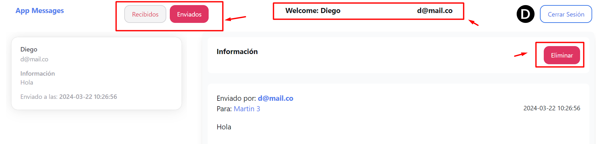

# Milestone 2: Maturing - Frontend

### As code improvements for Frontend from group 9 to group 8, we suggest:

1. Refactor **state management** to avoid using variable typing with `<any>`.
2. Refactor **docker image build** to a multi-stage build and run the container from an nginx server, this helps optimize the image size.
3. Implement **tests**.
4. Create a `<docker-compose>` file to facilitate **application initialization** among developers collaborating on the project.
5. Show **user information** in the Home component.
6. Improve **user experience** in managing the form to send emails, validating email format and preventing the email writing window from closing when errors occur.

The solution proposal for each of the previous points will be sent to the HG-8 via **pull request ([https://github.com/TechFellowGroup8/ft-email-send/pull/9#issue-2198815609]())**

# Milestone 4: New Feature

### As new features:

1. We create an email Inbox and Outbox (Sent).
2. We include user information in the home component's header.
3. We implemented the option to delete messages in Inbox and Sent.

   

   New features are available in the main branch, changes required modifications on both the front and back.
